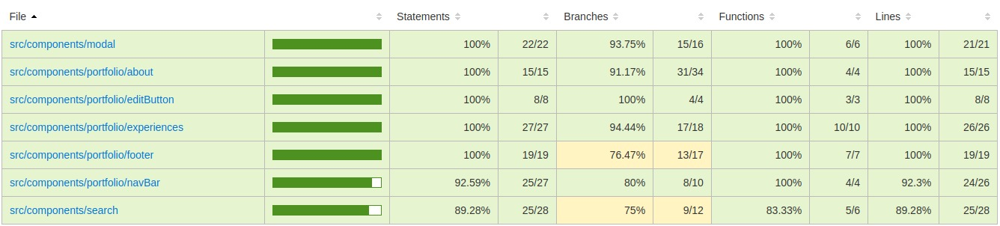

# Desafio 02 - AWS React

## Descrição do Projeto

O projeto desenvolvido tem um escopo de portifólio profissional. Se trata de uma plataforma onde o usuário poderá visualizar e editar os seus dados de portifólio, podendo fazer autenticação com GitHub e consumir os dados do usuário existente no GitHub utilizando suas APIs públicas.

## Tecnologias Utilizadas

- **React** para construção de interfaces
- **Axios** para requisições HTTP
- **Firebase** para validação de login
- **React Router DOM** para navegação
- **Context API** para gerenciamento de estados
- **TypesScript** para criação de tipagem
- **React Icons** para exibir icones
- **React-Hook-Form** para criação e validação de formulários

## Instalação

**1.Clone o repositório: git clone https:** //github.com/Danilosrr/desafio-03-aws-react

**2.Navegue até o diretório do projeto:** cd desafio-02-aws-react

**3.Instale as dependências:** npm install

**4.Inicie o servidor de desenvolvimento:** npm start

## Funcionalidades

#### Requisitos Gerais

- Consumo das APIs públicas do GitHub para popular as telas (onde aplicável);
- Uso do Firebase Authentication para autenticação do usuário;
- Deploy da aplicação no ambiente EC2 da AWS;
- Cobertura mínima de pelo menos 70% do código com testes unitários em Jest, e cobertura ideal de 90%;
- Caso algum campo não traga a informação, não exiba o dado;
- Criação das páginas e componentes com React (HTML, CSS e TS), importando apenas as imagens do Figma;
- Uso dos hooks React básicos (useState, useRef, useEffect) e hooks customizados (se necessário);
- Roteamento entre páginas com React Router DOM;
- Componentização de elementos da tela onde aplicável, passando dados por props;
- Commits semânticos, atômicos e uso de GitFlow (trabalhar com branches, branch develop > main e PRs);
- Organização de pastas e arquivos;
- Telas em conformidade e harmonia visual conforme o Figma;
- Botões/links com feedback visual em hover/interação;
- Arquivos/pastas com nomes legíveis e padronizados (camelCase, kebab-case, língua utilizada, etc);

#### Funcionalidades Principais

- **Consumo de API**: Consumo das APIs públicas do Github.
- **Componentização**: Componentização de elementos, utilizando props.
- **Responsividade**: Responsividade com foco em mobile-first.
- **Interatividade**: Feedback visual em botões, links e ações do usuário;
- **Autenticação**: Uso do Firebase Authentication para autenticação do usuário;
- **Navegação**: Implementação de rotas utilizando React Router.
- **Estados**: Uso de hooks básicos e, se necessário, criação de hooks customizados.
- **Design**: Criação de páginas e componentes conforme um design especificado.

## Telas

    
    
     
    
    
     
    
    
     
    
    

## Cobertura de testes

    

